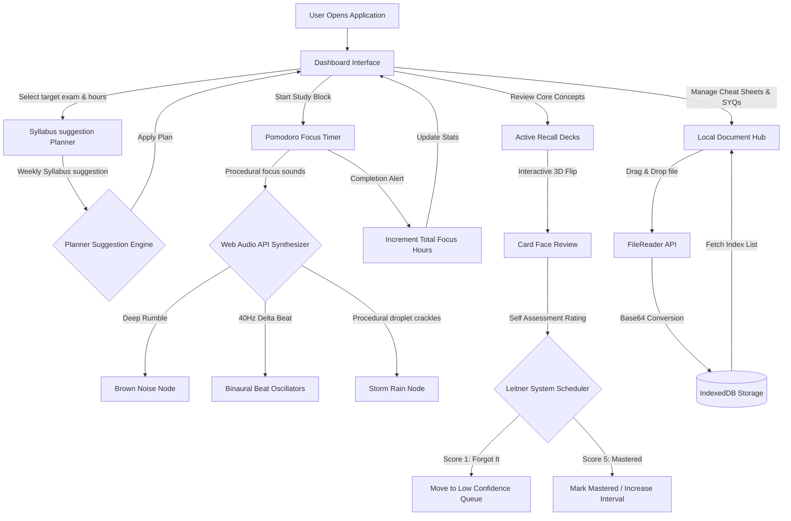

# Pheonix-Study Companion

Pheonix-Study Companion is a premium, client-side single-page web application designed for students preparing for high-intensity competitive examinations (such as UPSC Civil Services, JEE Main & Advanced, NEET, GRE/GMAT, and GATE). 

It features a modern, dark glassmorphic interface that integrates study schedule suggestion generators, active recall flashcard systems, customizable Pomodoro clocks with procedural ambient focus audio synthesis, and a sandboxed offline file storage system.

---

## 🗺️ Architecture & Workflow



---

## 🔄 App Workflows

1. **Dashboard Home**: Consolidates focus hours, study streaks, and exam configurations. If a schedule has been compiled, it highlights the target tasks for the current day.
2. **Syllabus Suggestion Planner**: The student enters their target competitive exam, study hours per day, and prep timeline. The planner compiles a custom 7-day study breakdown allocating subjects, revisions, and full mock tests.
3. **Pomodoro Focus**: Houses the custom timer. Students select a countdown duration (Focus, Short Break, or Long Break) and trigger procedurally synthesized study music or their linked Spotify embed widget to eliminate ambient distractions.
4. **Active Recall**: Students review custom or pre-seeded study decks. On card flip, they rate their memory confidence, which updates the card's spacing queue.
5. **Document Sync Hub**: Upload zone supporting PDFs, study notes, and syllabus spreadsheets. Files are stored locally on the device, ensuring they are persistently available and load instantly without cloud configuration.

---

## 🧮 Algorithms & Specifications

### 1. Web Audio Procedural Synthesis Algorithm
To provide noise-canceling study aids without relying on network streams, Pheonix implements real-time audio synthesis:
* **Brown Noise**: Generated dynamically by integrating white noise. The algorithm integration formula updates output sample $y(n)$ from white noise input $x(n)$ using a single-pole filter:
  $$y(n) = \frac{y(n-1) + 0.02 \cdot x(n)}{1.02}$$
  The signal is then multiplied by a compensation gain factor of $3.5$ to balance volume.
* **40Hz Binaural Beats**: Employs two standard `OscillatorNode` sources. The left channel is panned and set to $200\text{ Hz}$, and the right channel is set to $240\text{ Hz}$. When listended to through headphones, the auditory cortex perceives a binaural difference of $40\text{ Hz}$, which matches the frequency of Gamma brainwaves associated with high concentration.
* **Synthesized Rain**: Combines a low-pass filtered brown noise node ($400\text{ Hz}$ cutoff) with rare, random high-amplitude impulse spikes ($p > 0.997$ per sample) routed through a high-pass filter ($1200\text{ Hz}$ cutoff) to simulate rain droplets hitting leaves.

### 2. Leitner System Recall Spacing Algorithm
To optimize active recall retention, flashcard scheduling operates on a custom Leitner rating system:
1. Card starts at `confidence = 1`.
2. When reviewed, the student chooses self-assessment options:
   * **Forgot It (Score 1)**: Immediately resets `confidence = 1`.
   * **Struggled (Score 3)**: Retains `confidence` levels, prompting sooner reviews.
   * **Mastered (Score 5)**: Sets `confidence = 5`.
3. The Active Study Session sorts the active review queue using the formula:
   $$\text{Queue Priority} = \text{Sort}(\text{cards}, \text{key} = \text{confidence } \text{ascending})$$
   This guarantees that items the student has forgotten or struggled with are shown first.

### 3. Sandbox Offline File Upload Lifecycle
To store documents securely without database servers, Pheonix implements the following upload path:
```
[File selected/dropped] ──> [FileReader reads as DataURL] ──> [Base64 String Created]
                                                                     │
[Document Grid Updates] <── [Put inside Object Store] <── [IndexedDB write transaction]
```
Files remain sandbox-isolated, meaning they do not leave the client device, preserving privacy and enabling complete offline operation.

---

## 🛠️ Local Installation & Setup

1. Clone this repository:
   ```bash
   git clone https://github.com/nikhilshibu82-arch/Pheonix-study-companion.git
   ```
2. Open the directory and launch a simple HTTP server:
   ```bash
   python -m http.server 8000
   ```
3. Navigate to `http://localhost:8000` in your web browser.
